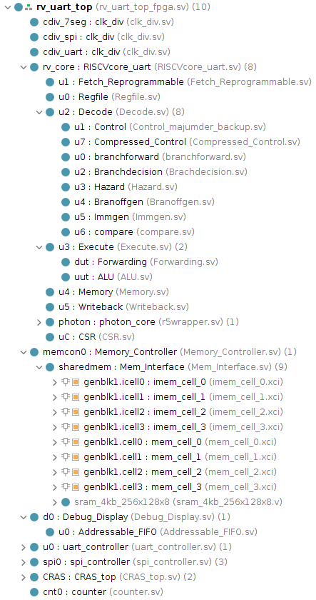

# Setting up and testing RISC-V Core
## Initial Vivado Setup
1. Create New Project.
3. Give the project a name and location.
4. Keep Project Type as RTL Project.
5. In Add Sources, add `[REPO]/src` directory.
6. In Add Constraints, add `[REPO]/constr/riscvcore_[YOUR BOARD]`.
7. Select your board. Example: `xc7a100tcsg324`.
8. Click Finish.
9. If not done in step 5, add all sources in `[REPO]/src` directory to Design Sources.
10. If not done in step 6, add constraints for your board in `[REPO]/constrs` directory to Constraints.
11. Add `[REPO]/sims` directory to Simulation Sources.
12. Add each file in `[REPO]/wcfg` (not directory) to Simulation Sources.
13. Change hierarchy to match below.



13. Create 8 Block RAM Cells. After creating one, use right-click > Copy IP... to speed up the process.
```
Block RAM Cells

Component name: mem_cell_0/1/2/3 and imem_cell_0/1/2/3

Basic
Interface Type: Native
Memory Type: Single Port RAM
ECC Type: No ECC
Write Enable: Unchecked
Algorithm Options: Minimum Area

Port A Options:
Write & Read Width: 8
Write & Read Depth: 16384
Operating Mode: Write First
Enable Port Type: Use ENA Pin
Uncheck Primitives Output Register and RSTA Pin

Other Options:
Check Fill Remaining Memory Locations
```
14. To test on FPGA, set core to use BRAM in mem_controller.sv. Change USE_SRAM to 0.
```
Line 168: mem_interface #(.USE_SRAM(0))...
```

## Inital Compilation Setup
1. Create a copy of `loadcoe_example.json` and rename it to `loadcoe.json`.
2. Modify the value of `path` to your Vivado project root directory.
```
{
    "path": "/your/path/riscv32_proj"
}
```

## Compilation
1. Compile the C code into a `.hex` file.
```
../scripts/prog/pycompile.py -x -o test.hex test.c uart.c print.c utils.c
```
2. Convert the `.hex` file into 4 separate `.coe` files and generate a `loadcoe.tcl` file.
```
python3 ../scripts/prog/coegen.py test.hex
```
3. *(OPTIONAL)* Generate a `clearcoe.tcl` file to use in resetting Block RAMs.
```
python3 ../scripts/prog/coegen.py --clear
```
4. *(OPTIONAL)* Create a text file with the RISC-V instructions created from the C code.
```
riscv32-unknown-elf-objdump -d test.elf > test.txt
```

## Loading Into Core
1. **FIRST-TIME LOAD:** Load initial `.coe` file into IP cores manually.

> For each `imem_cell`, check Load Init File and browse to and select
> each `.coe` file.

2. **SUCCESSIVE LOADS:** In Tcl Console, run `loadcoe.tcl` script and load instruction memory with the 4 .coe files.
```
source scripts/prog/tcl/loadcoe.tcl
```
3. Click Generate Bitstream.
4. Click Open Hardware Manager
5. Click Open target > Auto Connect
6. Click Program device > Program

## Simulating Core
1. In Simulation Sources, right-click `tb_rvtop.sv` and click Set as Top.
2. Click Run Simulation > Run Behavioral Simulation
